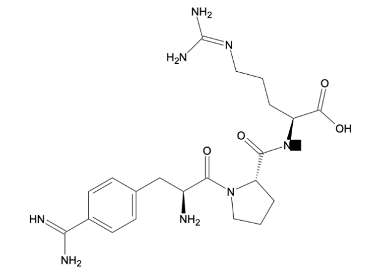
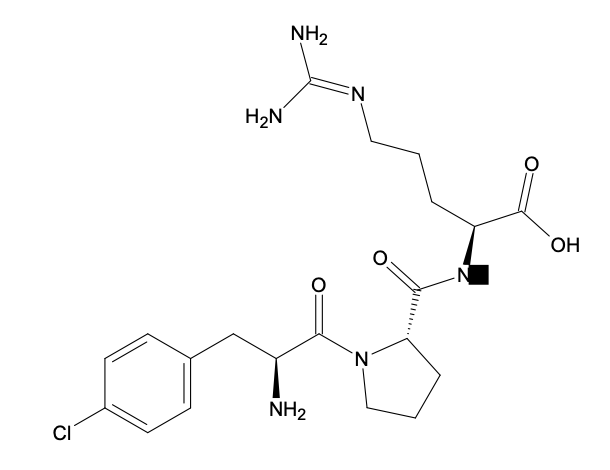

 # Docking process

Molecular docking is an established computational structure-based method used in drug discovery. It allows the identification of potential drug targets and predicting molecular ligand-target interactions at the atomic level. In this project we used the [AutodockVina](https://vina.scripps.edu/manual/) for as a docking scoring function. Because docking score does not provide a usefull information about the ligand-protein interaction, we did not rely on the score. The important output of the docking procedure in general, is the conformation of the ligand in the binding site. A proper conformation of the ligand in the binding site, can actually indicates a potential inhibition to the given target(Thrombin). Proper conformation means that the compound that we need to test conform all the crucial interactions with the key amino acids of the binding site.

For this project, we investigate the thrombin target and we were asked to find a potential new thrombin inhibitor. We took the [5AFZ](https://vina.scripps.edu/manual/) entry and we investigate the crucial interaction of the UET, the ligand that inhibits thrombin. We set this ligand as a control compound. The most crucial interactions were the above:

Hydrophobic interactions:

- VAL 213

Hydorgen Bonds:

- ASP 189
- SER 214
- GLY 216
- GLY 219

From the database that we created we took the compounds with the best IC50 values. Our mission was to adjust those compounds so as to gain more crucial interactions. Compared with the control compound, we docked three of them, 4 docking pose each.

The first compound with the best exparimantal data value, was aligned perfectly with the control compound. This might be a good indication for the proper docking pose. 

The second compound of our list was docked later on. Again the first docking pose was aligned perfectly with the control compound.

Later, we tried to enhance the given structures so as to gain more interaction and probably increase the affinity. We wanted to add some reasonable adjustments that can easily been synthesized by the chemists in the wet lab. The amino imino group which was presenting in the control compound was missing for the molecule which has the best IC50 value. So we implement this group to the benzene ring that was available. We wanted to gain the ASP 189 interaction. After the docking, we took 4 different poses. The third one had the conformation that we wanted. The docking score was the lowest but this is just a prediction. We considered not to rely on docking score but only on the conformation which is crucial in this step of drug discovery. Later, using Molecular Dynamics and Free Energy Perturbation we can asses the docking poses.

We gave a name to this compound, PEP1:

Later, we wanted to investigate if an halogen bond can be created between our compound and ASP 189. We docked first a compound for our list with IC50 value better that the control ligand, anh which also has a benzene ring with an halogen, in this case Chloride. After the docking, the two compounds were perfectly aligned once again. So we adjust the PEP1 compound and except from inserting an amino imon group, we implement a chloride.
The docking poses in this compound PEP2, were not as we predicted. The crucial interaction with the ASP 189, was gained this time by the carboxilic acid, and a new halogen bond was created with a different residue. Further investigations need to be made to assess both docking poses. They both seem that can actually increase the affinity and probably the selectivity by gaining more crucial interactions.

PEP2

Both PEP1 and PEP2 compounds adhere the well known Lipinski Rule of Five. For the code, see ../PEP_project/Machine_Learning.

In the above tables, the predicted pIC50 values, docking scores and experimental values can be seen. 

 # Discussion 
 
We were able to generate two new compounds which they both gain all the crucial interactions with the binding site of thrombin. However, they conformed differently compared with the control compound. PEP1 conformed as control but PEP2 conformed in a different way. They are both creating crucial interaction with key binding site residues. Further investigation need to be done to validate the docking poses, Molecular Dynamics and Free Energy Perturbation. Docking scores were not consider as crucial indications. We relied only on conformation and interactions. To be able to rely on docking scores, we have to use different docking score functions so as not to be biased. 
